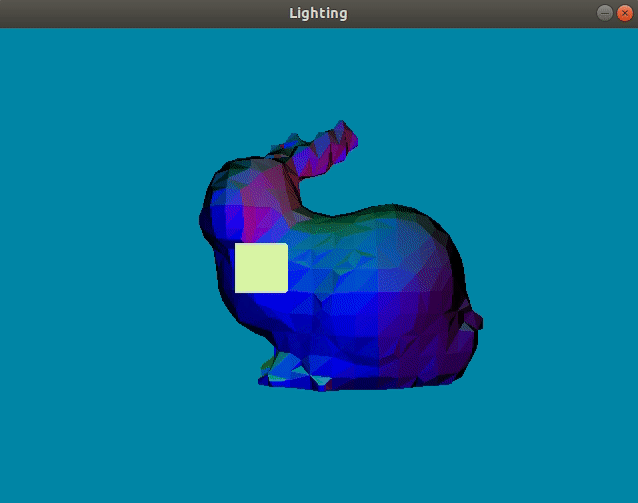

# Phong Illumination and (Directional/Point) Light

> "Adding atmosphere with lighting"

## Implementation Logistics

- You may use whatever operating system, IDE, or tools for completing this lab/assignment.
	- However, my instructions will usually be using the command-line, and that is what I will most easily be able to assist you with.
- In the future there may be restrictions, so please review the logistics each time.

**For this Lab/Assignment**: You will be working on your own laptop/desktop machine. Historically, the setup is the most difficult part of the assignment, because supporting multiple architectures and operating systems can be tricky. Nevertheless, we will get through it!

# Resources to help

Some additional resources to help you through this lab assignment

| SDL related links                                    | Description                       |
| --------------------------------------------------    | --------------------------------- |
| [SDL API Wiki](https://wiki.libsdl.org/APIByCategory) | Useful guide to all things SDL2   |
| [My SDL Youtube Playlist](https://www.youtube.com/playlist?list=PLvv0ScY6vfd-p1gSnbQhY7vMe2rng0IL0) | My Guide for using SDL in video form.   |
| [Lazy Foo](http://lazyfoo.net/tutorials/SDL/)         | Great page with written tutorials for learning SDL2. Helpful setup tutorials for each platform. |
| [Lazy Foo - Handling Key Presses](https://lazyfoo.net/tutorials/SDL/04_key_presses/index.php) | Useful tutorial for learning how to handle key presses | 

| OpenGL related links                                | Description                       |
| --------------------------------------------------  | --------------------------------- |
| [My OpenGL Youtube Series](https://www.youtube.com/playlist?list=PLvv0ScY6vfd9zlZkIIqGDeG5TUWswkMox) | My video series for learning OpenGL |
| [docs.gl](http://docs.gl)                           | Excellent documentation to search for OpenGL commands with examples and description of function parameters   |
| [learnopengl.com](https://learnopengl.com)          | OpenGL 3.3+ related tutorial and main free written resource for the course   |

# Description

Lights! Camera! Action!

Err, well we need to add the lights -- and that is exactly our goal for this assignment. For this assignment we are going to be implementing the phong illumination model for a directional light (this can be a purely directional light, or you can also use a point light which has a radius).

## Task 1 - .obj object display

The first task of this PSET is to incorporate your previous .obj loader into this one. That is, we should be able to load an object(.obj) file through the command-line arguments and view it with a perspective projection.

You may otherwise use the graphics abstraction provided and implement a new surface, or otherwise you can create a project from scratch.

## Task 2 - Phong Illumination - Point Lights

Your next task is to implement the phong illumination model. Recall that the phong illumination model consists of 3 components.

1. Ambient
2. Diffuse
3. Specular

The following page will be a great resource for getting started: [learnopengl.com/Lighting/Basic-Lighting](https://learnopengl.com/Lighting/Basic-Lighting). You can take as inspiration some of the constants used for the ambient, diffuse, and specular for example.

For the purpose of this assignment you can implement either a 'directional light' that otherwise always shines towards the objetct or you can implement a 'point light', such that it still shines out in all directions (with a radius), but the light 'loses energy' (i.e. attenuates) over distance.

For this portion of the assignment, **you must implement** at least one directional light (directional light, cone shaped spotlight, or a point light). Your **light** must also move -- this is how we'll know if your lighting is actually working (and I recommend to have it just circle around the origin(this will give you some practice with sine/cosine and polar coordinates to create a simple orbit, or otherwise using a rotation and translation matrix).

Note: I would recommend when you get one light working, you can then try to have multiple lights. You can assume the lights are perfectly 'white light (rgb(1.0f,1.0f,1.0f))', but it again may be nice to add the light colors as an attribute to create a more dynamic scene.

### Task 3 - Interactive graphics 

Please keep the following interactive components from the previous assignment. If you add more to your camera, that is also fine.

The tasks for interactivity in this assignment are the following:

- Pressing the <kbd>tab</kbd> key draws your object in wireframe mode (By default when you start the application it will show the model in filled).
- Pressing the <kbd>esc</kbd> key exits the application.
- Pressing the arrowkeys keys should move your camera forward and backwrds

A resource for performing [keyboard input with SDL is provided here](http://lazyfoo.net/tutorials/SDL/04_key_presses/index.php)

## Assignment Suggestions and Strategies 

### Debugging

- If you do not see anything on your screen, consider using wireframe, or otherwise drawing the points only (GL_POINTS) for the rendering mode.
- If you don't see anything, this is a good assignment to try to capture a frame with renderdoc so you can trace the event browser and see what the function calls are.

### Assignment strategy

Some tips:

- Start slowly and add one feature at a time.
  - I might suggest getting your .obj loader working.
  - Then, I would suggest adding an abstraction for a light, so I can see a lights position in 3D space with a cube first.
  - Then I would work on getting that 'cube' surrounding your .obj model.
  - Finally, I would add in the phong illumination model with a light positioned at the light source, and otherwise interacting with the normals of the 3D object.

### How we will run your program

For this PSET we will run:

1. `dub` to make sure we see a bunny that is lit up.

# Submission/Deliverables

### Submission

- Commit all of your files to github, including any additional files you create.
- Do not commit any binary files unless told to do so (i.e. the executable that you run does not need to be committed).
- Do not commit any 'data' files generated when executing a binary.

### Deliverables

- Commit your source code to this repository with your changes.
	- We should be able to execute your program by running `dub` or `dub --compiler=ldc2` or `dub --compiler=gdc-12`
  - (No need to ever commit binary/executable files to the repository)

# Going Further

What is that, you finished Early? Did you enjoy this lab/assignment? Here are some (optional) ways to further this assignment.

- You can build on top of this PSET such that you otherwise add as many functions as you like.
- Consider adding more textures, or even other lighting types.
- Visualizing the normals of the object (using color) or with lines can also be useful.

# F.A.Q. (Instructor Anticipated Questions)

* Q: Can I add more?
  * A: Yes, of course! Just as an FYI, textures and normal mapping are coming up.
  * It may be neat to be able to render with and without normals being visualized (i.e. change between a solid color and rendering with normals)
* Q: How do I know it works?
  * A: There should always be some ambient component, so your object should not be totally dark.
  * A: For diffuse, the objects front should become darker as the light moves behind it -- that's how you'll know your normals are facing the right way.
  * A: For specular, you should see a 'bright spot' that somewhat lines up to where the light is shining. If this is too hard to see, try turning off temporarily the ambient and diffuse components.
* Q: I'm struggling in the shader?
  * A: Remember, to improve your iteration speed, you can
* Q: glsl says a variable does not exist, but I definitely have it in my code!
  * A: glsl tries to be efficient -- and that's probably a uniform variable you're referring too. If you don't use a variable (or if it's impossible to reach e.g. `if(false) { // uniform here }` ) then that variable will get optimized out.
  * Comment: That seems silly
  * Reponse: No. Consider that our vertex or fragment shaders may run 1000s or even millions of times per frame -- we need to be efficient.

# Found a bug?

If you found a mistake (big or small, including spelling mistakes) in this lab, kindly send me an e-mail. It is not seen as nitpicky, but appreciated! (Or rather, future generations of students will appreciate it!)

- Fun fact: The famous computer scientist Donald Knuth would pay folks one $2.56 for errors in his published works. [[source](https://en.wikipedia.org/wiki/Knuth_reward_check)]
- Unfortunately, there is no monetary reward in this course :)
